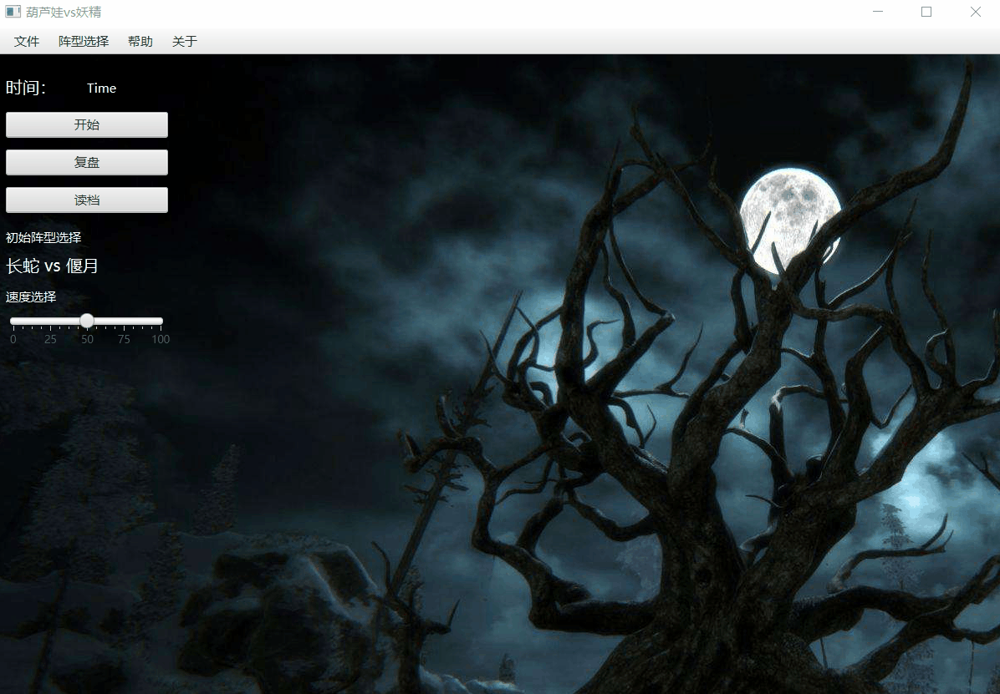
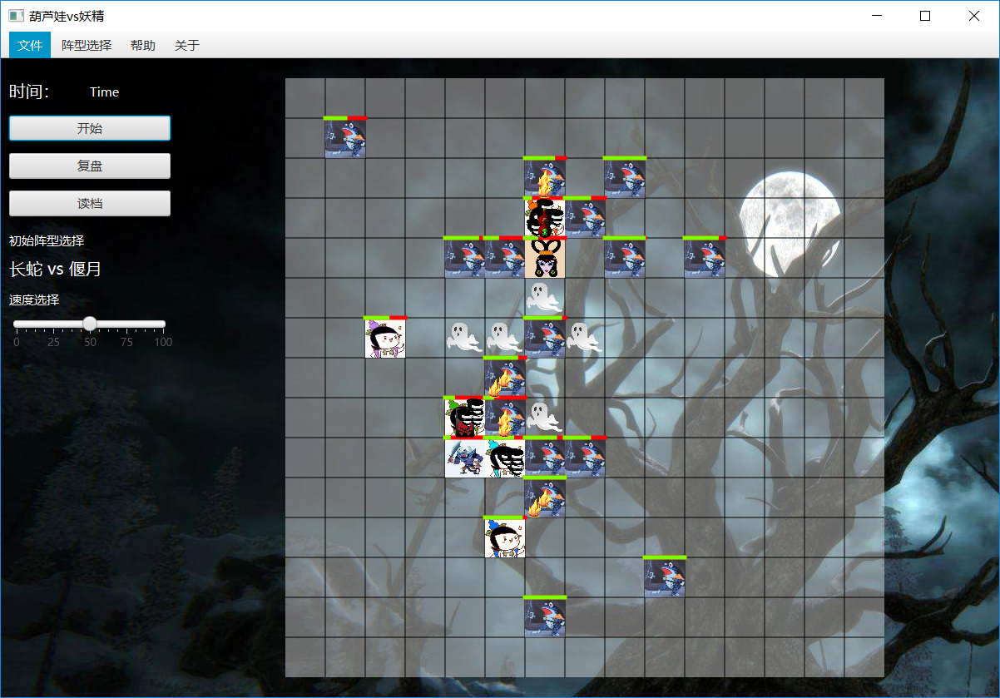
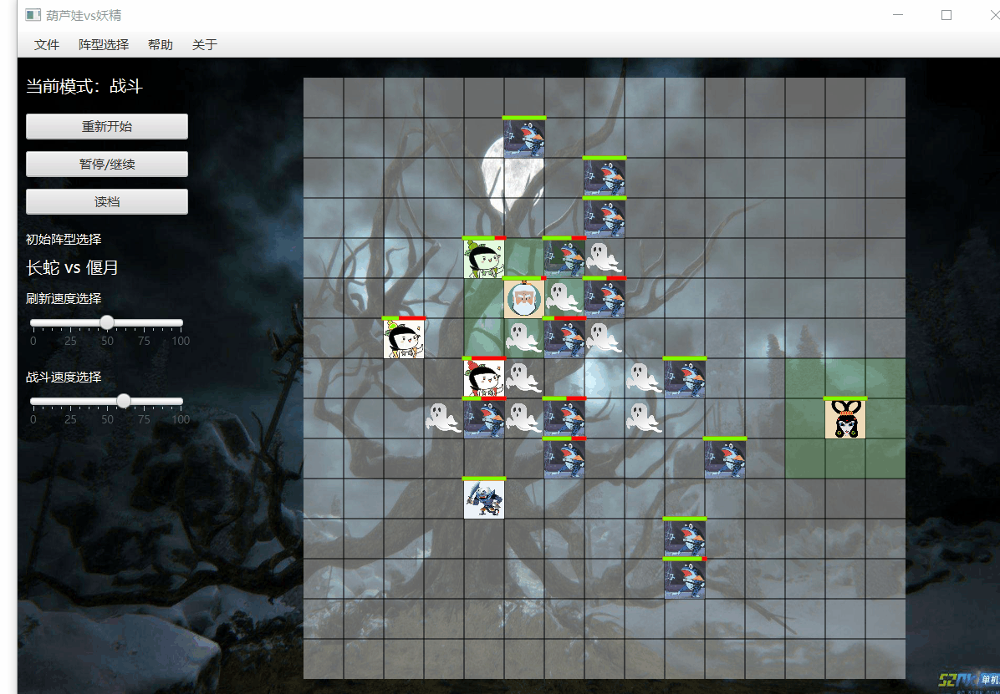
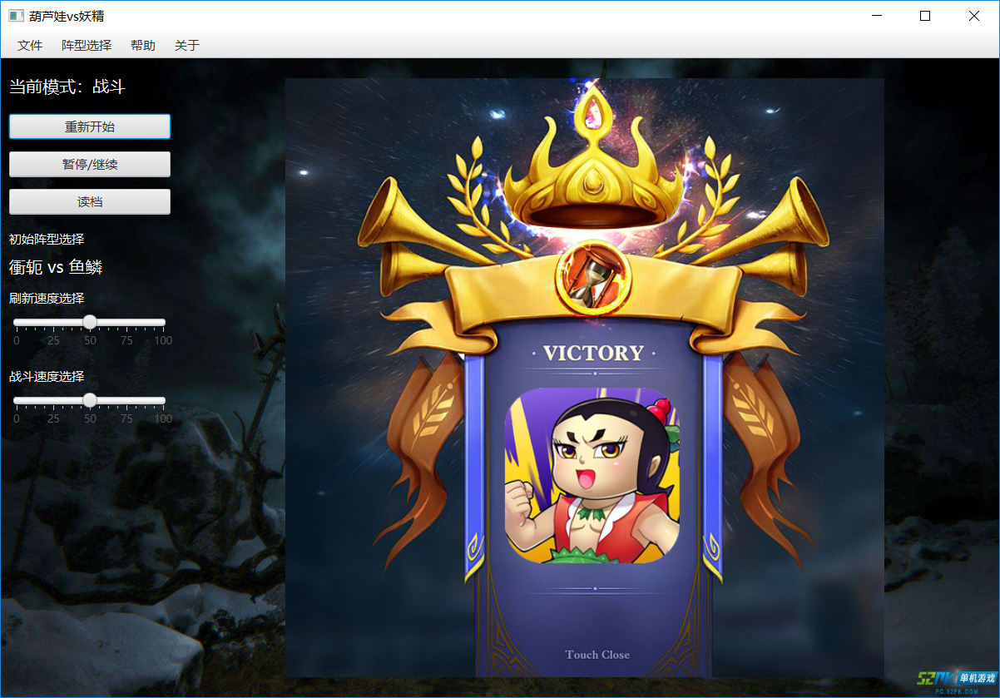
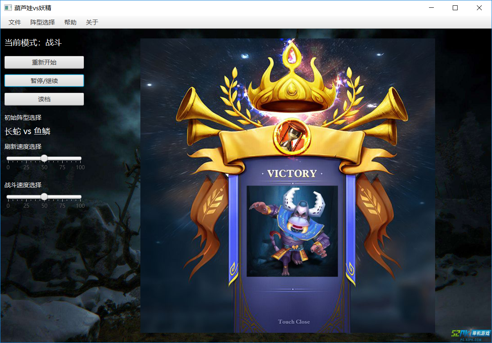

# 大作业：葫芦娃大战妖精

> 南京大学计算机科学与技术 Java程序设计课程大实验
>
> 161220096 欧阳鸿荣

[TOC]

## 0.概述

| 开发环境               | 运行环境 | 构建环境           | GUI框架 | 最后一次更新 |
| ---------------------- | -------- | ------------------ | ------- | ------------ |
| IntelliJ IDEA 2018.2.2 | JDK 1.8  | Apache Maven 3.5.4 | Javafx  | 2018/12/25   |

本项目的独立git源码仓库在https://github.com/Tsunaou/CalabashBoys-WarGames，若有兴趣可以共同探讨。

## 1.项目构建

``` bash
# 运行需要安装maven环境
mvn clean test package
```

在配置好Maven 的系统中，在系统CMD或者各种bash中输入上述命令即可得到本程序的jar包。

## 2.项目运行

项目构建后，jar包位于```target/葫芦娃vs妖精 2.1.jar```，双击即可运行本程序。

### (1) 初始界面

双击jar包并打开程序后，进入初始界面。可以看到战场上空无一物。

在菜单栏中可以为葫芦娃和妖精们选择初始阵型。默认阵型为长蛇 vs 偃月阵型。这是对葫芦娃最为艰难的阵型。若想葫芦娃取得胜利的概率大一些，可以选择如下的长蛇 vs 鱼鳞阵型。

<div>
    
</div>

### (2) 战斗过程

点击左侧**“开始“**按钮即可开始战斗。战斗过程中。葫芦娃和妖精们会自动寻找敌人战斗。双方遇到自己攻击范围内的敌人则抢占线程开始攻击。攻击过程中对方的HP会减少。当HP减少到0时生物便死亡。死亡后会留下一个幽灵在死亡地点上，并占据那个空间（此时那个方格不能再有生物进入）。为了防止生物被困死，各个生物除了正常移动，还有一定小概率会闪现在其附近。

<div>
    
</div>

双方战斗过程中，会有背景音乐和战斗音效播放，同时对于每次攻击都会有战斗动画。这个机制是我对于如何让两个葫芦娃的战斗变得有趣而生动想出来的方法。当战场中生物数量小于10人时，意味着战斗极其激烈，此时背景音乐将会切换，提示战斗的白热化。

<div>
    
</div>

### (3)战斗结束

当葫芦娃或者妖精有一方数量为零时，则剩下的线程也结束。显示结束的画面并且播放葫芦娃方或妖精方胜利的音乐，并且系统自动将刚刚的记录文件保存在当前目录下，名为```record.huluwa```。此时用户可以选择退出程序或者读取刚刚的记录文件进行复盘。

<div>
    
    
</div>

### (4)读取记录文件

在战斗未开始或结束状态下，可以点击左侧**“读档”**按钮选择文件进行读取。本程序的记录文件为```.huluwa```后缀的文件，读取成功后即可复盘。复盘中依然有攻击音效和攻击动画，尽量让记录文件生动形象。

<div>
    
</div>


------

## 3.程序结构

### 1.程序主要的UML图

#### a.生物

<div>
    
</div>


#### b.阵法

<div>
    
</div>


### 2.程序划分

程序采用	```Apache Maven 3.5.4  ```管理，JavaFx为GUI开发的工具。程序主要代码置于```src/main/java```中，资源文件置于```src/main/resources```中，单元测试的测试样例置于```src/test```中。

程序主要分4个包：表示生物的```beings```，表示阵法的```Formation```和负责实现图形化界面的```GUI```。程序入口`main`函数所在类统一为`class Main`

下面分别阐述代码中用到哪些面向对象的概念、机制、设计理念，以及这样做的目的和好处

#### a.Beings 存在

正如上述UML图中所示，在Being中主要处理的是葫芦娃、爷爷、蝎子精、蛇精、小喽啰等的关系，

在写作业二的时候，对于葫芦娃是用了枚举类型，以便限定葫芦娃的个数等特征。但是在这次作业中，由于考虑到在施展阵型中，利用多态和继承关系带来的极大便利性，因此在经过一番考虑后，采用枚举类限制初始化各个生物的状态，因此有了如下3个枚举类（由于引入了RTTI，因此不需要记录生物的种类）：

| 类名            | 意义         | 内容                                               |
| --------------- | ------------ | -------------------------------------------------- |
| CalabashName    | 葫芦娃的姓名 | 老大，老二，老三，老四，老五，老六，老七           |
| Color           | 葫芦娃的颜色 | 红色，橙色，黄色，绿色，蓝色，靛色，紫色           |
| EnumCalabashBoy | 七个葫芦娃   | 类似作业二中，把每个葫芦娃对应的颜色和姓名等初始化 |

有了以上的枚举类后，对于生物，尤其是葫芦娃的初始化就限定在了一定范围内，因此创建了以下7个类

| 类名        | 继承于   | 解释                                 | 物种     |
| :---------- | -------- | ------------------------------------ | -------- |
| Beings      | Object   | 存在，是一切的基础                   | Null     |
| Creature    | Beings   | 生物                                 | Null     |
| CalabashBoy | Creature | 葫芦娃                               | 葫芦娃   |
| Grandpa     | Creature | 爷爷                                 | 人类     |
| Monster     | Creature | 普通妖怪                             | 怪物     |
| Scorpion    | Monster  | 蝎子精，脱胎于普通妖怪，是更强的存在 | 妖怪首领 |
| Snake       | Monster  | 蛇精，，脱胎于普通妖怪，是更强的存在 | 妖怪首领 |

##### Q1:生物体要怎么动起来呢？

鉴于要让每个生物都是一个线程，因此我在父类```Creature```中实现了```Runnable```接口。

```java
public class Creature extends Beings implements Runnable, Config ,Fighting{
    void run(){
        while(Living){
            ...//run()方法逻辑
		}
    }
}
```

于是，在```BattleFieldController```中，便可以通过线程池对线程进行管理，让葫芦娃们战斗。

##### **Q2:生物体要如何战斗呢？**

这时候想到课上讲过的接口的概念，让不同类的可以共享并且重写自己的加油方法。因此定义了两个接口**CheeringUp**和**Fighting**（Fighting的定义是为了给阵型中的生物使用，但是具体的实现没有给出）

```java
public interface CheeringUp {
    void CheeringUp(Maps maps, int x, int y);
}

public interface Fighting {
    void Fighting(Maps maps,int x,int y);
}
```

##### Q3:生物体有什么属性？

这里我使用一个```Config```接口来规范一些配置属性，这想法来源于**Thinking in Java**中的接口部分中提到的一个（有点过时的）方法，当然我觉得这个方法还是不错。通过接口来创建常量组，这样就可以给葫芦娃、爷爷等各种生物规定一些参数配置，也使得战斗的风格更多样化，也便于后期维护：

```java
public interface Config {
	...
    //基准伤害
    final int DAMAGE_PER = 15;
    //攻击力
    final int ATK_Creature = 5;
    final int ATK_Calabash = 8;
    ...
    //防御力
    final int DEF_Creature = 5;
    final int DEF_Calabash = 10;
    ...
    //生命值
    final int HP_Creature = 100;
	...
    //攻击范围
    final int Scale_Creature = 1;
   	...
}
```

那么战斗时，每个生物体都有初始血量，受到攻击时，己方血量的减少通过下面的公式计算：

​	**失去血量 = （对方攻击力/我方防御力）* 基准伤害** 

既体现出了属性的不同，也让游戏更具有多样性。


**通过实现不同的接口，可以让不同生物实现不同行为，并且通过多态，子类可以呈现出更多样化的战斗。**

**运用继承和接口，让生物间的关系变得更加有序，也使得程序的组织和语义都有了更好的约束。**


#### b.Formation 阵法

阵法，实际上就是让特定的人，在特定的地图上的特定位置摆出特定队形，因此无论是何种阵法，都是一样的原理，因此在此，定义了抽象类**Formation**

```java
abstract public class Formation {
    protected int startX;   //阵法领导者的X坐标
    protected int startY;   //阵法领导者的Y坐标

    public Formation(int startX, int startY) {
        this.startX = startX;
        this.startY = startY;
    }

    abstract public void SetFormation(Maps maps, Creature[] creatures,int direction);
    ....
}
```

正如上述UML图所示，一共有8个类继承并且给出了**SetFormation**方法的具体实现，分别对应8种阵法

同时，考虑到阵型的繁琐和实际意义，在我的程序中，阵型实际上只是让葫芦娃和妖精们等生物站到战场上的不同位置而已，因此我在这里使用了**工厂设计模式**，给阵型设置一个工厂类```FormationFactory```，将工厂类的方法都设为静态方法，每次使用时工厂类产生一个对象即可。


#### c.GUI 图形显示

从Swing到JavaFx的迁移中，为了表示地图并且实现GUI，我主要实现了3个类

| 类名         | 解释                                                 | 描述                 |
| ------------ | ---------------------------------------------------- | -------------------- |
| Unit         | Creature的容器，拥有坐标，使用泛型                   | 空间上的格点         |
| Maps         | 由Unit组成的二维矩阵，使用泛型，负责存储和并绘制战场 | 战场的地图，二维平面 |
| DisplayField | 负责Maps的展示，每隔一定时间刷新，负责战斗的绘制     | 战场的定时刷新       |

程序中除了主线程以及各个生物的线程以外，我额外实现了一个```DisplayField```类，并实现了```Runnable```接口，这个类主要负责GUI的定期绘制，并与主线程和生物线程分离。GUI的绘制使用的主要是Javafx中的```canvas```控件，生物体在Maps中移动，而每隔一段时间通过```DisplayField```类的方法对```Maps```中的信息进行绘制，实现了部分解耦，也体现了**SRP原则**。


## 4.总结与思考

#### a.总结

本程序用到了许多

##### 1.RTTI的运用

此前的程序中，用了一个名为```CreatureType```的枚举类，意图是为了确定类的类型。但是学了RTTI后，删去了跟该类有关的结构，在使用父类对象引用表示的子类对象时，用```getClass().getSimpleName()```来得到类的信息。

##### 2.Collection的应用

此前的程序中，使用的是Java中的一位数组和二维数组用来存储，这次重构中，统一使用```ArrayList```来表示数组，同时程序中也用了```HashTable```等容器，增加了安全性和便利性。

对于二维数组，起先其实是不打算用容器来重构，但是由于数组的元素被我用泛型重构了，因此我遇到了“无法定义泛型的数组”的问题，因此我用一个看上去略复杂的结构来表示```ArrayList<ArrayList<unit<T>>> maps;```

不过这个结构也有一些方便，就是更好地表示了二维数组的存储方式。

##### 3.Generics的应用

这个应该是本次重构中重构范围最广的应用了。通过泛型的使用，将许多方法和类解耦，扩大了其适用范围，也增加了程序的可扩展性。

(1) 运用了继承、抽象类、接口的技巧，使得程序的组织更加有趣，更符合面向对象的理念，更接近现实

(2) 运用了枚举类，将对象的内容限制在一个有限的集合内，更加符合实际，也使得程序更安全

(3) 实现了阵型的GUI表示，更加生动

#### b.思考

(1) 加油我的实现就是用一个接口来实现，让蛇精和爷爷能够主动出现在战场的某个位置，但是有点别扭

(2) 阵型的实现，除了长蛇，雁行，冲轭阵的适用范围较为广泛以外，其他的阵型都受到较大的限制

(3) 对于阵型的冲突以及溢出都只做了初步的判断，程序的鲁棒性还不足。 


## 5.致谢

很感谢

#### 