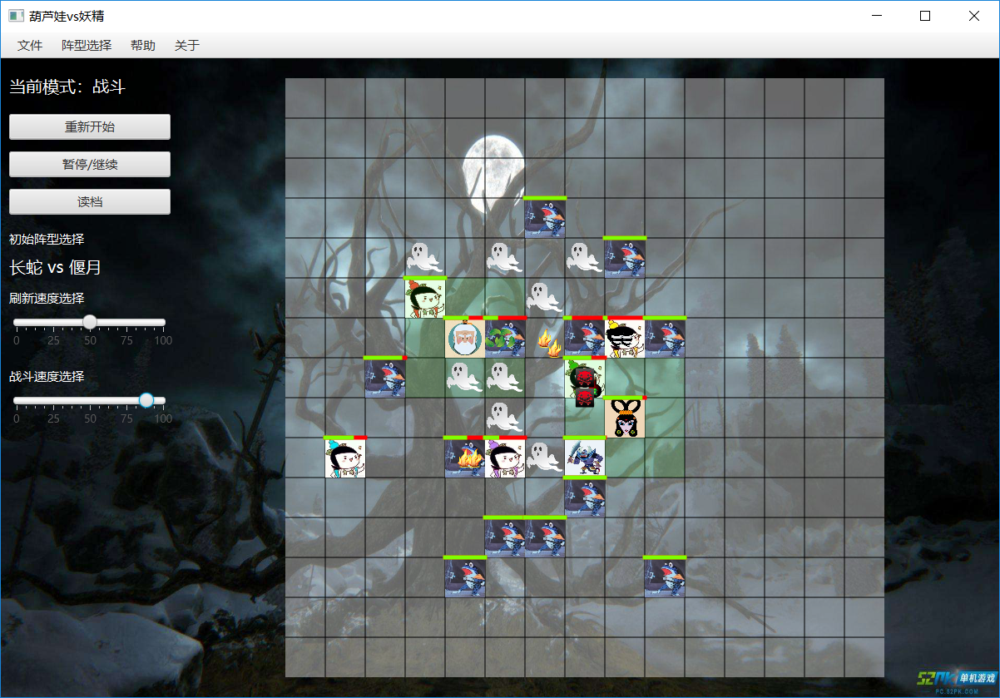
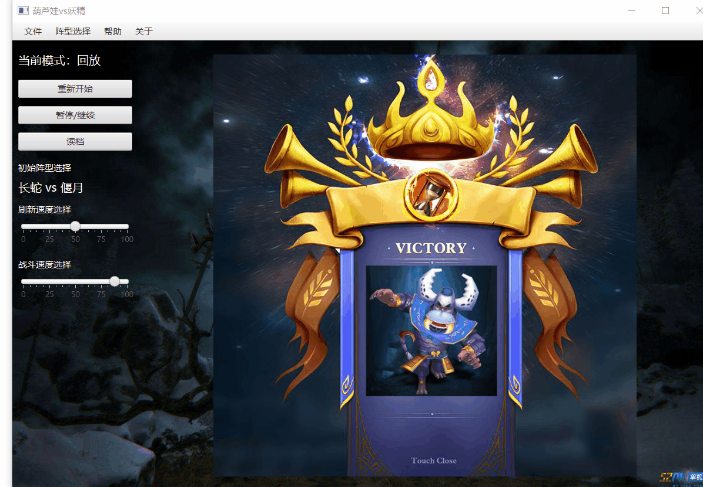

# 大作业：葫芦娃大战妖精

> 南京大学计算机科学与技术 Java程序设计课程大实验
>
> 161220096 欧阳鸿荣

[TOC]

## 0.概述

| 开发环境               | 运行环境 | 构建环境           | GUI框架 | 迭代版本   |
| ---------------------- | -------- | ------------------ | ------- | ---------- |
| IntelliJ IDEA 2018.2.2 | JDK 1.8  | Apache Maven 3.5.4 | Javafx  | 2.0 最终版 |

本项目的独立git源码仓库在https://github.com/Tsunaou/CalabashBoys-WarGames，若有兴趣可以共同探讨。

## 1.项目构建

``` bash
# 运行需要安装maven环境
mvn clean test package
```

在配置好Maven 的系统中，在系统CMD或者各种bash中输入上述命令即可得到本程序的jar包。

## 2.项目运行

项目构建后，jar包位于```target/葫芦娃vs妖精 2.1.jar```，双击即可运行本程序。

### (1) 初始界面

双击jar包并打开程序后，进入初始界面。昨天状态栏显示当前状态为**“初始”**状态。可以看到战场上空无一物。

在菜单栏中可以为葫芦娃和妖精们选择初始阵型。默认阵型为长蛇 vs 偃月阵型。这是对葫芦娃最为艰难的阵型。若想葫芦娃取得胜利的概率大一些，可以选择如下的长蛇 vs 鱼鳞阵型。

<div>
    
</div>


### (2) 战斗过程

选择好初始阵型后，点击左侧**“开始“**按钮或在键盘键入**回车**即可开始战斗，此时“开始”按钮变成**“重新开始”**。同时左侧状态栏显示为**“战斗”**状态。战斗过程中，点击左侧**“暂停/继续“**按钮或在键盘键入**P**即可暂停或继续游戏。

战斗过程中。葫芦娃和妖精们会自动寻找敌人战斗。双方遇到自己攻击范围内的敌人则抢占线程开始攻击。攻击过程中对方的HP会减少。当HP减少到0时生物便死亡。死亡后会留下一个幽灵在死亡地点上，并占据那个空间（此时那个方格不能再有生物进入）。为了防止生物被困死，各个生物除正常移动，还有一定小概率会闪现在其附近。

<div>
    
</div>
游戏过程中各个种类的生物都有不同的属性，增加了游戏的趣味性。其中老爷爷和蛇精可以为一定范围内己方阵营的人增加生命值，在图中表示为淡绿色透明的质量区域。同时身为玩家，你也可以通过方向键控制爷爷的行动，当然如果你没有输入命令，爷爷也会自己去寻找敌人。不过由于爷爷是葫芦娃们心中最重要的人，玩家如何让爷爷发挥最大的作用，还需要慢慢去琢磨了。

双方战斗过程中，会有背景音乐和战斗音效播放，同时对于每次攻击都会有战斗动画。这个机制是我对于如何让两个葫芦娃的战斗变得有趣而生动想出来的方法。当战场中生物数量小于10人时，意味着战斗极其激烈，此时背景音乐将会切换，提示战斗的白热化。

<div>
    
</div>
在左侧状态栏有两条滚动条，分别是刷新速度选择和战斗速度选择。刷新速度选择是战场中每一帧刷新的速度，而战斗速度是生物体移动和战斗的速度。玩家可以通过拖动滚动条对这两者的速度进行选择，以免有时候战斗太慢了而你心急如焚。当然要注意两个问题，首先回放的时候，速度由刷新速度决定。其次，不要一下把速度改得太快，不然有可能程序一下子没反应过来而出现“未响应”状态，还是循序渐进方得始终啊。

### (3)战斗结束

当葫芦娃或者妖精有一方数量为零时，则剩下的线程也结束。显示结束的画面并且播放葫芦娃方或妖精方胜利的音乐，并且系统自动将刚刚的记录文件保存在当前目录下，名为```record.huluwa```。此时用户可以选择退出程序或者读取刚刚的记录文件进行复盘。

<div>
    
    
</div>

### (4)读取记录文件

在战斗未开始或结束状态下，可以点击左侧**“读档”**按钮或按键盘键入**“L”**选择文件进行读取。本程序的记录文件为```.huluwa```后缀的文件，读取成功后即可复盘。复盘中依然有攻击音效和攻击动画，尽量让记录文件生动形象。同时，```record```文件夹下也有一些精彩的记录，如果有兴趣可以打开看看。

<div>
    
</div>
### (5)使用帮助

点击菜单栏的**帮助**和**关于**，可以得到关于本游戏的操作说明和一些开发信息，程序也更加符合规范。

<div>
    
    
</div>
------

## 3.程序结构

### 1.程序主要的UML图

#### a.生物

<div>
    
</div>


#### b.阵法

<div>
    
</div>

### 2.程序划分与代码说明

程序采用	```Apache Maven 3.5.4  ```管理，JavaFx为GUI开发的工具。程序主要代码置于```src/main/java```中，资源文件置于```src/main/resources```中，单元测试的测试样例置于```src/test```中。

程序主要分4个包：表示生物的```beings```，表示阵法的```Formation```和负责实现图形化界面的```GUI```和表示排序的```sort```包。```GUI```包中还有```Record```包负责文件记录的操作。程序入口`main`函数所在类统一为`class Main`

下面分别阐述代码中用到哪些面向对象的概念、机制、设计理念，以及这样做的目的和好处

#### a.Beings 存在

正如上述UML图中所示，在Being中主要处理的是葫芦娃、爷爷、蝎子精、蛇精、小喽啰以及逝者等的关系，

在写作业二的时候，对于葫芦娃是用了枚举类型，以便限定葫芦娃的个数等特征。但是在这次作业中，由于考虑到在施展阵型中，利用多态和继承关系带来的极大便利性，因此在经过一番考虑后，采用枚举类限制初始化各个生物的状态，因此有了如下4个枚举类（由于引入了RTTI，因此不需要记录生物的种类）：

| 类名            | 意义         | 内容                                                   |
| --------------- | ------------ | ------------------------------------------------------ |
| CalabashName    | 葫芦娃的姓名 | 老大，老二，老三，老四，老五，老六，老七               |
| Color           | 葫芦娃的颜色 | 红色，橙色，黄色，绿色，蓝色，靛色，紫色               |
| EnumCalabashBoy | 七个葫芦娃   | 类似作业二中，把每个葫芦娃对应的颜色和姓名等初始化     |
| Camp            | 阵营         | 正义方（葫芦娃们）、邪恶方（妖怪们）、中立方（逝者们） |

有了以上的枚举类后，对于生物，尤其是葫芦娃的初始化就限定在了一定范围内，因此创建了以下8个类

| 类名        | 继承于   | 解释                                 | 物种     |
| :---------- | -------- | ------------------------------------ | -------- |
| Beings      | Object   | 存在，是一切的基础                   | Null     |
| Creature    | Beings   | 生物                                 | Null     |
| CalabashBoy | Creature | 葫芦娃                               | 葫芦娃   |
| Grandpa     | Creature | 爷爷                                 | 人类     |
| Monster     | Creature | 普通妖怪                             | 怪物     |
| Scorpion    | Monster  | 蝎子精，脱胎于普通妖怪，是更强的存在 | 妖怪首领 |
| Snake       | Monster  | 蛇精，，脱胎于普通妖怪，是更强的存在 | 妖怪首领 |
| DeathObject | Creature | 死去的生物                           | Null     |

相比于之前的作业，本次大实验中由于有图形化的机制，因此每个存在还都有一个```image```属性，表示它的图片。而生物体都有一个```imageAtk```属性，表示其攻击的特效。这样就使得我们的生物丰富多彩了起来。并且在类的构造器中就完成文件的IO读取，也使得程序的运行速度提高。

##### **Q1:生物体要如何战斗呢？**

这时候想到课上讲过的接口的概念，让不同类的可以共享并且重写自己的加油方法。因此我定义了3个接口**CheeringUp、Fighting、Curable**，分别表示助威，战斗与治疗。

```java
//助威接口，被Snake和Grandpa类实现，可以空降在战场上的(x,y)坐标加油助威
public interface CheeringUp {
    void CheeringUp(Maps maps, int x, int y);
}
//战斗接口，被Creature类实现，同时子类对其override实现不同的战斗行为
public interface Fighting {
    void Fighting(Maps maps,int x,int y);
}
//治疗接口，被Snake和Grandpa类实现，为附近的同阵营生物回复生命值
public interface Curable {
    void cure();
}
```

##### Q2:生物体要怎么动起来呢？

鉴于要让每个生物都是一个线程，因此我在父类```Creature```中实现了```Runnable```接口。

```java
public class Creature extends Beings implements Runnable, Config ,Fighting{
    void run(){
        while(Living){
            ...//run()方法逻辑
		}
    }
}
```

于是，在```BattleFieldController```中，便可以通过线程池对线程进行管理。

在run()方法中，有基本的和```Fighting(),moveRandom()```，分别定义了其战斗和移动两个操作。至于怎么战斗，怎么移动，这里就用了Java中多态的机制，在子类中override方法，则可以通过方法的动态绑定实现多样化操作。

##### Q3:生物体有什么属性？

这里我使用一个```Config```接口来规范一些配置属性，这想法来源于**Thinking in Java**中的接口部分中提到的一个（有点过时的）方法，当然我觉得这个方法还是不错。通过接口来创建常量组，这样就可以给葫芦娃、爷爷等各种生物规定一些参数配置，也使得战斗的风格更多样化，也便于后期维护：

```java
public interface Config {
	...
    //基准伤害
    final int DAMAGE_PER = 15;
    //攻击力
    final int ATK_Creature = 5;
    final int ATK_Calabash = 8;
    ...
    //防御力
    final int DEF_Creature = 5;
    final int DEF_Calabash = 10;
    ...
    //生命值
    final int HP_Creature = 100;
	...
    //攻击范围
    final int Scale_Creature = 1;
   	...
}
```

那么战斗时，每个生物体都有初始血量，受到攻击时，己方血量的减少通过下面的公式计算：

	**失去血量 = （对方攻击力/我方防御力）* 基准伤害** 

既体现出了属性的不同，也让游戏更具有多样性。

##### Q4:怎么通过方向键控制爷爷的移动？

这主要通过重写爷爷的```moveRandom()```方法得以实现。上文说过，所有生物体的移动都是通过```moveRandom()```函数得以实现的。这也体现了多态和动态绑定的好处。在爷爷的类中，有一个队列用于记录爷爷接收到的移动方向。

```java
private Queue<Direction> options = new ArrayDeque<>();
```

当用户键入指令时，指令进队。然后重写爷爷的```moveRandom()```方法

```java
    @Override
    public synchronized void moveRandom() {
        if(options.isEmpty()){
            super.moveRandom();
        }else{
            //如果当前指令队列里有指令的话,就取出指令方向运行
            //如果当前方向有生物，则该指令逃逸并无效。
        }
    }
```

总而言之，通过实现不同的接口，可以让不同生物实现不同行为，并且通过多态，子类可以呈现出更多样化的战斗。运用继承和接口，让生物间的关系变得更加有序，也使得程序的组织和语义都有了更好的约束。

#### b.Formation 阵法

阵法，实际上就是让特定的人，在特定的地图上的特定位置摆出特定队形，因此无论是何种阵法，都是一样的原理，因此在此，定义了抽象类**Formation**

```java
abstract public class Formation {
    protected int startX;   //阵法领导者的X坐标
    protected int startY;   //阵法领导者的Y坐标

    public Formation(int startX, int startY) {
        this.startX = startX;
        this.startY = startY;
    }

    abstract public void SetFormation(Maps maps, Creature[] creatures,int direction);
    ....
}
```

正如上述UML图所示，一共有8个类继承并且给出了**SetFormation**方法的具体实现，分别对应8种阵法

同时，考虑到阵型的繁琐和实际意义，在我的程序中，阵型实际上只是让葫芦娃和妖精们等生物站到战场上的不同位置而已，因此我在这里使用了**工厂设计模式**，给阵型设置一个工厂类```FormationFactory```，将工厂类的方法都设为静态方法，每次使用时工厂类产生一个对象即可。

```java
public class FormationFactory {
    public static ChangShe createChangShe(int x, int y){
        return new ChangShe(x,y);
    }
    public static ChongE createChongE(int x, int y){
        return new ChongE(x,y);
    }
    .....
}
```

#### c.GUI 机制

GUI图形的显示用的是javafx的GUI框架，通过JavaFX Scene Builder 2.0对battleField.fxml进行可视化图形编辑，并且通过绑定css文件来进行界面的美化，绑定java中的```battleFieldController```来实现交互。

```java
public class Main extends Application {
    public void start(Stage primaryStage) throws Exception {
        Parent root = FXMLLoader.load(getClass().getClassLoader().getResource("battleField.fxml"));
        primaryStage.setTitle("葫芦娃vs妖精");
        primaryStage.setScene(new Scene(root, 1200.0D, 800.0D)); //设置初始的窗口大小
        primaryStage.show();

        //监听窗口关闭事件，回收线程
        primaryStage.setOnCloseRequest(new EventHandler<WindowEvent>() {
            @Override
            public void handle(WindowEvent event) {
                System.out.print("窗口关闭");
                System.exit(0);
            }
        });
    }
    public static void main(String[] args) {
        launch(args);
    }
}
```

从Swing到JavaFx的迁移中，为了表示地图并且实现GUI，我主要实现了以下5个类

| 类名         | 解释                                                 | 描述                 |
| ------------ | ---------------------------------------------------- | -------------------- |
| Coordinate   | 表示坐标，有x和y两种属性                             | 坐标                 |
| Unit         | Creature的容器，拥有Coordinate坐标，使用泛型         | 空间上的格点         |
| Maps         | 由Unit组成的二维矩阵，使用泛型，负责存储和并绘制战场 | 战场的地图，二维平面 |
| DisplayField | 负责Maps的展示，每隔一定时间刷新，负责战斗的绘制     | 战场的定时刷新       |
| GUITimer     | 计时器，负责各个线程的睡眠任务                       | 计时器               |

程序中除了主线程以及各个生物的线程以外，我额外实现了一个```DisplayField```类，并实现了```Runnable```接口，这个类主要负责GUI的定期绘制，并与主线程和生物线程分离。GUI的绘制使用的主要是Javafx中的```canvas```控件，生物体在Maps中移动，而每隔一段时间通过```DisplayField```类的方法对```Maps```中的信息进行绘制，实现了部分解耦，也体现了**SRP原则**。

#### d.记录文件的保存与读取

关于记录文件的保存，我都放在```Record```包中实现，包中主要有以下类

| 类名           | 解释                                                         |
| -------------- | ------------------------------------------------------------ |
| AtkRecord      | 记录一次攻击的发起者，以及攻击者和被攻击者的坐标             |
| ObjectRecord   | 记录一个生物的坐标和血量                                     |
| Recorder       | 拥有一个AtkRecord和一个ObjectRecord的ArrayList，记录一帧中发生的动作 |
| RecorderSystem | 封装并提供文件的存取的接口                                   |

通过上述的类，即可实现存档和读档操作。而在存档的过程中，一开始我的想法是把状态和行为映射到各种字符串上，因此设计并实现了上述各类，但是后来在阅读Thinking in java的过程中，我突发奇想是否能用序列化的方法直接把所有的记录序列化存储，然后再通过反序列化的手段读取记录，这样一方面实现了数据封装，同时也避免了频繁映射之中带来的信息损失，极大程度上保留了战斗的过程。

于是我让```AtkRecord  ```类，```ObjectRecord```类，```Recorder```类，```Coordinate```类，```Creature```类都```implements Serializable```接口使得上述各类可以序列化。于是就可以通过```ObjectOutputStream```和```ObjectInputStream```实现战斗记录的存取和读取。

则有了```RecorderSystem```类中的两个主要方法：

```java
//读档
public ArrayList<Recorder>  openRecord(){
    //...
    //用户选择读取的文件，将文件反序列化成ArrayList<Recorder>的记录链后返回
    return  recorders;
}
//存档
public void saveRecord(ArrayList<Recorder> recorders){
    //...
    //将记录列表ArrayList<Recorder> recorders序列化存储
}
```

则每次战斗结束可以将记录写入```record.huluwa```文件中。同时也只能读取```.huluwa```格式的文件，更加安全。

<div>
    
</div>
## 4.总结与思考

#### a.知识的应用与总结

本程序用到了许多课上所学的知识。

- ##### **多线程与线程同步问题**

  在我的设计中，对于各个生物体都都享有一个```static maps```，上面承载着战场的各种信息。而每个生物体是一个线程，这也就意味着生物体之间势必会对资源争夺，同时也会引发线程不安全的问题。针对这个问题，我主要通过```synchronized```关键字对临界区资源进行限制，保证一次只能有一个线程访问```maps```并对其进行修改。为了保证鲁棒性，对一些常用的特定方法也用了该关键词限定，当然如果程序设计无问题的话这只是一层永远不会用到也不希望用到的保险。

  ```java
  synchronized (maps){
  	maps.showMaps();
  	if(firstDisplay){
  		GUITimer.displaySleep(3);
  	firstDisplay = false;
  	}
  }
  ```

- ##### 序列化的应用

  这里主要是在存档中用到了序列化。这是一个意料之外的无心之举，但是取得的效果蛮不错的。这也让我体会到了Java在跨平台上强大之处。通过序列化和反序列化可以将对象在各种媒介中传输，真的让我感受到了Java 的魅力。

  ```java
  ArrayList<Recorder> recorders = new ArrayList<>();
      try{
          ObjectInputStream in = new ObjectInputStream(new FileInputStream(file));
          //读入葫芦娃标志
          String s = (String)in.readObject();
          //读入记录序列
          recorders = (ArrayList<Recorder>)in.readObject();
          System.out.println(recorders);
      }catch (ClassNotFoundException | IOException e){
          System.out.println(e);
      }
  }
  ```

- ##### RTTI的运用

  此前的程序中，用了一个名为```CreatureType```的枚举类，意图是为了确定类的类型。但是学了RTTI后，删去了跟该类有关的结构，在使用父类对象引用表示的子类对象时，用```getClass().getSimpleName()```来得到类的信息。


- ##### Collection的应用

  此前的程序中，使用的是Java中的一位数组和二维数组用来存储，这次重构中，统一使用```ArrayList```来表示数组，同时程序中也用了```HashTable```等容器，增加了安全性和便利性。

  对于二维数组，起先其实是不打算用容器来重构，但是由于数组的元素被我用泛型重构了，因此我遇到了“无法定义泛型的数组”的问题，因此我用一个看上去略复杂的结构来表示```ArrayList<ArrayList<unit<T>>> maps;```

  不过这个结构也有一些方便，就是更好地表示了二维数组的存储方式。


- ##### Generics的应用

  这个应该是本次重构中重构范围最广的应用了。通过泛型的使用，将许多方法和类解耦，扩大了其适用范围，也增加了程序的可扩展性。

  - 运用了继承、抽象类、接口的技巧，使得程序的组织更加有趣，更符合面向对象的理念，更接近现实
  - 运用了枚举类，将对象的内容限制在一个有限的集合内，更加符合实际，也使得程序更安全
  - 实现了阵型的GUI表示，更加生动

- ##### Maven的应用

  Maven作为一个强大的构建工具，这次实验也让我感受到了他的魅力之处。从前编写C++等代码时，项目在不同主机上迁移时，编译器和额外的库都是一个很麻烦的事情，而Java虽然因为运行在JVM上减少了很多问题，但是Java丰富而齐全的包也给程序的管理带来了很大的麻烦。而Maven真的是一个很好用的工具，本次我使用的是最为简单的Maven框架，尽管如此Maven清晰的架构和方便的管理都使得我对它很有好感。代码放```src```里，资源放```resource```里，测试代码放```test```里，一目了然，且项目迁移时只需要```pom.xml```即可发挥作用。

- ##### 单元测试的应用

  单元测试也是一个特别好用的东西。尤其是在Maven中，结合```JUnit```可以很方便地编写测试样例对代码进行测试。在本次实验中我主要对葫芦娃站队的排序算法和生物移动时的越界事件进行了单元测试，并自定义了```OutBounceException```异常用于在生物越界时进行处理，增加了程序的鲁棒性。

- ##### 注解的应用

  初次接触的注解是```@Override```注解，这是IDEA自动生成的，经过系统学习和阅读相关资料后才明白它的作用，后来陆续使用了```@Test,@Deprecated,@supressWarning```注解，同时在每个类文件中，都自定义了如下格式的注解序列：

  ```java
  /**
   * @ Author     ：Young
   * @ Date       ：Created in 11:52 2018/12/22
   * @ Description：时间控制器，用于控制休眠
   */
  ```

  通过注解的标签，可以让Javadoc工具智能识别并生成文档，并且可以给代码增加信息量，增加了开发效率。

- ##### 异常的应用

  异常处理是Java一个很重要的机制，在项目中我也多次运用。其中最为经典的便是两个地方

  - GUITimer类：时间控制器，用于控制休眠。

    在执行sleep时，必须对可能发生的```InterruptedException```异常进行处理。

    ```java
    public class GUITimer {
        public static void displaySleep(int ms){
            try {
                TimeUnit.MILLISECONDS.sleep(ms);
            } catch (InterruptedException e) {
                e.printStackTrace();
            }
        }
    }
    ```

  - RecorderSystem类：负责记录的保存和读取

    由于采用了序列化，因此在文件IO时，除了```IOException```，还可能出现```ClassNotFoundException```，因此要对其进行处理。(完美碰到考点，然而我没注意这里的异常名)

    ```java
    try{
    	ObjectInputStream in = new ObjectInputStream(new FileInputStream(file));
    	String s = (String)in.readObject();	//读入葫芦娃标志
    	recorders = (ArrayList<Recorder>)in.readObject();//读入记录序列
    	System.out.println(recorders);
    }catch (ClassNotFoundException | IOException e){
    	e.printStackTrace();
    }
    ```

#### b.设计原则和设计模式的使用

本程序也运用了一些设计原则和设计模式

- ##### SRP 单一职责原则

  程序中，能抽象的尽可能抽象。```BattleFieldController```类接受外界输入控制游戏逻辑，```Maps```类负责战场地图的存储，```Dispaly```类负责战场的实时刷新，```GUITimer```类负责控制线程的睡眠，```RecorderSystem```负责文件的读取和存储。各个类各司其职，降低耦合度，提高内聚性。

- ##### OCP开放封闭原则

  程序中在```Being```和```Formation```类中都运用到了这个原则。封装不变部分，开放变化部分，一般使用接口继承实现方式来实现“开放”应对变化。尤其是在战斗的逻辑过程中，通过接口来赋予子类不同的行为。

- ##### LSP里氏替换原则

  对于程序中的子类，可以替换任何基类能够出现的地方，并且经过替换以后，代码还能正常工作。这里主要针对的是```Creature```类和他子类之间的关系。

- ##### ISP接口隔离原则

  程序中没有“胖接口”，把战斗中的行为抽象成了3个单独的接口```Fighting,CheeringUp和Curable```这三个符合特定行为的单一简单接口。

- ##### CARP合成/聚合复用原则

  ```Maps```类中地图是```Unit```的聚合，```Record```是```AtkRecord```和```ObjectRecord```的聚合。

- ##### 工厂设计模式

  考虑到阵型的繁琐和实际意义，在我的程序中，阵型实际上只是让葫芦娃和妖精们等生物站到战场上的不同位置而已，因此我在这里使用了**工厂设计模式**，给阵型设置一个工厂类```FormationFactory```，将工厂类的方法都设为静态方法，每次使用时工厂类产生一个对象即可。

#### c.思考与不足

然而我自认为程序还是有很大的问题

- ##### 面向对象思维不足

  虽然运用了继承、抽象类、接口的技巧，使得程序的组织更加有趣，更符合面向对象的理念，更接近现实，但是实际上我自己明白，许多地方我使用的依然是面向过程的方法，特别是在GUI的消息处理函数中。这让我感受到思维的转变是如此艰难，同时对比本学期其他课程，Java课程也让我最感受到了面向对象的思想。

- ##### 系统耦合度太高

  尽管说我尽可能解耦，但是系统中各个类的依赖程度还是挺高的，尤其是在GUI和Maps中，耦合度真的特别高，许多方法实际上都是针对特定例子所实现的。

- ##### 游戏可玩性不足

  虽然可以对爷爷的行为进行操作，但是游戏的可玩度依然不高并且由于我的线程刷新机制的实现方法和线程间的抢占关系，并不能很流畅地控制。


## 5.致谢

很感谢曹春老师和余萍老师本学期的辛勤的指导和精彩的讲解，也感谢助教在自己的研究和课业之余解答我各种疑惑并维护github上的pull request。Java课让我第一次真正体会到了面向对象的思想，虽然尚未完全吸收掌握，但起码入了个门也是不错的选择。也感谢在这门课中与我互相探讨，并且耐心解答我疑惑的同学和舍友，有人指引让我走了不少弯路。

Java的大作业是艰难的，不过我其实满享受写代码的过程的，不过考试也让我明白了理论先行写出来的代码才是更合规范也更好。其实这门课不仅仅是语言和面向对象思想的学习，我感觉这门课更像是真正成为程序员的必经之路，尽管只有两个课时，但是从git的使用，markdown和README的书写，设计模式与设计方法到maven等一系列构建工具的引入，这都是游离于Java之外却又十分有用的知识。

这也是我第一次写关于并发程序，以往只是操作系统课程中概念，实际操作中也体会到了并发的困难与其魅力之处，也让我克服了对并发的畏难心理。

**再次表达对曹春老师和余萍老师以及两位助教和各位同学们本学期的指导和帮助。**

